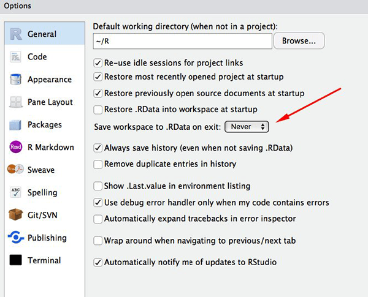

```{r setup, include=FALSE}
knitr::opts_chunk$set(warning = FALSE, message = FALSE, cache = FALSE)
```

# What is this part of the hands-on about?

**Questions:**

- What are R and RStudio? 

**Objectives:**

- Describe the purpose of the RStudio Script, Console, Environment, and Plots panes.
- Organise files and directories for a set of analyses as an R project, and understand the purpose of the working directory.
- Use the built-in RStudio help interface to search for more information on R functions.

**Keypoints:**

- Setting up R and RStudio

# What is R? What is RStudio?

The term [R](https://www.r-project.org/) is used to refer to the
*programming language*, the *environment for statistical computing*
and *the software* that interprets the scripts written using it.

[RStudio](https://rstudio.com) is currently a very popular way to not
only write your R scripts but also to interact with the R
software. To function correctly, RStudio needs R and
therefore both need to be installed on your computer.

The [RStudio IDE Cheat
Sheet](https://raw.githubusercontent.com/rstudio/cheatsheets/main/rstudio-ide.pdf)
provides much more information than will be covered here, but can be
useful to learn keyboard shortcuts and discover new features.

# Why learn R?

## R does not involve lots of pointing and clicking, and that's a good thing

The learning curve might be steeper than with other software, but with
R, the results of your analysis do not rely on remembering a
succession of pointing and clicking, but instead on a series of
written commands, and that's a good thing! So, if you want to redo
your analysis because you collected more data, you don't have to
remember which button you clicked in which order to obtain your
results; you just have to run your script again.

Working with scripts makes the steps you used in your analysis clear,
and the code you write can be inspected by someone else who can give
you feedback and spot mistakes.

Working with scripts forces you to have a deeper understanding of what
you are doing, and facilitates your learning and comprehension of the
methods you use.

## R code is great for reproducibility

Reproducibility means that someone else (including your future self) can
obtain the same results from the same dataset when using the same
analysis code.

R integrates with other tools to generate manuscripts or reports from your
code. If you collect more data, or fix a mistake in your dataset, the
figures and the statistical tests in your manuscript or report are updated
automatically.

An increasing number of journals and funding agencies expect analyses
to be reproducible, so knowing R will give you an edge with these
requirements.

## R is interdisciplinary and extensible

With 10000+ packages that can be installed to extend its
capabilities, R provides a framework that allows you to combine
statistical approaches from many scientific disciplines to best suit
the analytical framework you need to analyse your data. For instance,
R has packages for image analysis, GIS, time series, population
genetics, and a lot more.


```{r, fig.cap = "Exponential increase of the number of packages available on [CRAN](https://cran.r-project.org/), the Comprehensive R Archive Network. From the R Journal, Volume 10/2, December 2018.", echo = FALSE, message = FALSE}
knitr::include_graphics("../fig/cran.png")
```

## R works on data of all shapes and sizes

The skills you learn with R scale easily with the size of your
dataset. Whether your dataset has hundreds or millions of lines, it
won't make much difference to you.

R is designed for data analysis. It comes with special data structures
and data types that make handling of missing data and statistical
factors convenient.

R can connect to spreadsheets, databases, and many other data formats,
on your computer or on the web.


## R produces high-quality graphics

The plotting functionalities in R are extensive, and allow you to adjust
any aspect of your graph to convey most effectively the message from
your data.


## R has a large and welcoming community

Thousands of people use R daily. Many of them are willing to help you
through mailing lists and websites such as [Stack
Overflow](https://stackoverflow.com/), or on the [RStudio
community](https://community.rstudio.com/). These broad user communities
extend to specialised areas such as bioinformatics. One such subset of the R community is [Bioconductor](https://bioconductor.org/), a scientific project for analysis and comprehension "of data from current and emerging biological assays." This workshop was developed by members of the Bioconductor community; for more information on Bioconductor, please see the companion workshop ["The Bioconductor Project"](https://carpentries-incubator.github.io/bioc-project/). 


## Not only is R free, but it is also open-source and cross-platform

Anyone can inspect the source code to see how R works. Because of this
transparency, there is less chance for mistakes, and if you (or
someone else) find some, you can report and fix bugs.

# Knowing your way around RStudio

Let's start by learning about [RStudio](https://www.rstudio.com/),
which is an Integrated Development Environment (IDE) for working with
R.

We will use the RStudio IDE to write code, navigate the files on our
computer, inspect the variables we are going to create, and visualise
the plots we will generate. 


```{r, results='markup', fig.cap="RStudio interface screenshot. Clockwise from top left: Source, Environment/History, Files/Plots/Packages/Help/Viewer, Console.", echo=FALSE, purl=FALSE, out.width='100%', fig.align='center'}
knitr::include_graphics("../fig/rstudio-screenshot.png")
```

The RStudio window is divided into 4 "Panes":

- the **Source** for your scripts and documents (top-left, in the
  default layout)
- your **Environment/History** (top-right),
- your **Files/Plots/Packages/Help/Viewer** (bottom-right), and
- the R **Console** (bottom-left).

The placement of these panes and their content can be customised (see
menu, `Tools -> Global Options -> Pane Layout`).

One of the advantages of using RStudio is that all the information you
need to write code is available in a single window. Additionally, with
many shortcuts, **autocompletion**, and **highlighting** for the major
file types you use while developing in R, RStudio will make typing
easier and less error-prone.

# Getting set up

It is good practice to keep a set of related data, analyses, and text
self-contained in a single folder, called the **working
directory**. All of the scripts within this folder can then use
**relative paths** to files that indicate where inside the project a
file is located (as opposed to absolute paths, which point to where a
file is on a specific computer). Working this way makes it a lot
easier to move your project around on your computer and share it with
others without worrying about whether or not the underlying scripts
will still work.

RStudio provides a helpful set of tools to do this through its "Projects"
interface, which not only creates a working directory for you, but also remembers
its location (allowing you to quickly navigate to it) and optionally preserves
custom settings and open files to make it easier to resume work after a
break. Go through the steps for creating an "R Project" for this
tutorial below.

1. Start RStudio.
2. Under the `File` menu (top left corner), click on `New project`. Choose `New directory`, then
  `New project`.
3. Enter a name for this new folder (or "directory"), and choose a
   convenient location for it. This will be your **working directory**
   for this session (or whole course) (e.g., `bioc-intro`).
4. Click on `Create project`.


Optionally, you can now navigate to `Tools` -> `Global Options` and select the 
‘Never’ option for ‘Save workspace to .RData’ on exit. This will prevent RStudio 
from saving your workspace to `.RData` when you close RStudio, which can become
very cumbersome and slow when working with larger datasets.

```{r, results='markup', fig.cap="Set 'Save workspace to .RData on exit' to 'Never'", echo=FALSE, purl=FALSE, out.width='70%', fig.align='center'}

```

To avoid [character encoding issues between Windows and other operating
systems](https://yihui.name/en/2018/11/biggest-regret-knitr/), we are
going to set `UTF-8` by default. To do this, navigate to 
`Tools` -> `Global Options` -> `Code` -> `Saving` and then chose `UTF-8` as the 
default text encoding. 


```{r, results='markup', fig.cap="Set the default text encoding to UTF-8 to save us headache in the coming future. (Figure from the link above).", echo=FALSE, purl=FALSE, out.width='70%', fig.align='center'}
knitr::include_graphics("../fig/utf8.png")
```

## Organizing your working directory

Using a consistent folder structure across your projects will help keep things
organised, and will also make it easy to find/file things in the future. This
can be especially helpful when you have multiple projects. In general, you may
create directories (folders) for **scripts**, **data**, and **documents**.

 - **`data/`** Use this folder to store your raw data and intermediate
   datasets you may create for the need of a particular analysis. You should
   *always* keep a copy of your raw data accessible and do as much of
   your data cleanup and preprocessing programmatically as possible. 
   Separating raw data from processed data is also a good idea. For example, 
   you could have files `data/raw/tree_survey.plot1.txt` and `...plot2.txt` kept
   separate from a `data/processed/tree.survey.csv` file generated by
   the `scripts/01.preprocess.tree_survey.R` script.
 - **`documents/`** This would be a place to keep outlines, drafts,
   and other text.
 - **`scripts/`** (or `src`) This would be the location to keep your R
   scripts for different analyses or plotting, and potentially a
   separate folder for your functions (more on that later).

You may want additional directories or subdirectories depending on
your project needs, but these should form the backbone of your working
directory.


```{r, results='markup', fig.cap="Example of a working directory structure.", echo=FALSE, purl=FALSE, out.width='100%', fig.align='center'}
knitr::include_graphics("../fig/working-directory-structure.png")
```

For this course, we will need a `data/` folder to store our raw data,
and we will use `data_output/` for when we learn how to export data as
CSV files, and `fig_output/` folder for the figures that we will save.

- **Challenge:** create your project directory structure

Under the `Files` tab on the right of the screen, click on `New Folder` and
create a folder named `data` within your newly created working directory
(e.g., `~/bioc-intro/data`). Repeat these operations to create a `data_output/` 
and a `fig_output` folders.

To create an R script, click on  `New Blank File` in the `Files` tab and then 
select `R Script`. Give it a suitable name and save it in the root of our working 
directory because we are only going to use one file and it will make things
easier.

Your working directory should now look like this:

```{r, results='markup',fig.cap="How it should look like at the beginning of this lesson", echo=FALSE, purl=FALSE, out.width='100%', fig.align='center'}
knitr::include_graphics("../fig/r-starting-how-it-should-look-like.png")
```

# Interacting with R

The basis of programming is that we write down instructions for the
computer to follow, and then we tell the computer to follow those
instructions. We write, or *code*, instructions in R because it is a
common language that both the computer and we can understand. We call
the instructions *commands* and we tell the computer to follow the
instructions by *executing* (also called *running*) those commands.

There are two main ways of interacting with R: by using the
**console** or by using **scripts** (plain text files that contain
your code). The console panel (in RStudio, the bottom left panel) is
the place where commands written in the R language can be typed and
executed immediately by the computer. It is also where the results
will be shown for commands that have been executed. You can type
commands directly into the console and press `Enter` to execute those
commands, but they will be forgotten when you close the session.

Because we want our code and workflow to be reproducible, it is better
to type the commands we want in the script editor, and save the
script. This way, there is a complete record of what we did, and
anyone (including our future selves!) can easily replicate the
results on their computer. Note, however, that merely typing the commands
in the script does not automatically *run* them - they still need to
be sent to the console for execution.

RStudio allows you to execute commands directly from the script editor
by using the `Ctrl` + `Enter` shortcut (on Macs, `Cmd` + `Return` will
work, too). The command on the current line in the script (indicated
by the cursor) or all of the commands in the currently selected text
will be sent to the console and executed when you press `Ctrl` +
`Enter`.

If R console is ready to accept commands, the R console shows a `>` prompt. If
it receives a command (by typing, copy-pasting or sending from the script
editor using `Ctrl` + `Enter`), R will try to execute it, and when
ready, will show the results and come back with a new `>` prompt to
wait for new commands.

If R is still waiting for you to enter more data because it isn't
complete yet, the console will show a `+` prompt. It means that you
haven't finished entering a complete command. This is because you have
not 'closed' a parenthesis or quotation, i.e. you don't have the same
number of left-parentheses as right-parentheses, or the same number of
opening and closing quotation marks.  When this happens, and you
thought you finished typing your command, click inside the console
window and press `Esc`; this will cancel the incomplete command and
return you to the `>` prompt.

# Seeking help

## Use the built-in RStudio help interface to search for more information on R functions

One of the fastest ways to get help, is to use the RStudio help
interface. This panel by default can be found at the lower right hand
panel of RStudio. As seen in the screenshot, by typing the word
"Mean", RStudio tries to also give a number of suggestions that you
might be interested in. The description is then shown in the display
window.

If you need help with a specific function, let's say `mean()`, you
can type:

```{r, eval=FALSE, purl=FALSE}
?mean
```

This will open up the `Help` panel, and provide detailed information what the
function actually does and what arguments it expects. 

```{r rstudiohelp, fig.cap="RStudio help interface.", results='markup', echo=FALSE, purl=FALSE, out.width='70%', fig.align='center'}
knitr::include_graphics("../fig/rstudiohelp.png")
```

A generic Google search "R \<task\>" will often either send
you to the appropriate package documentation or a helpful forum where someone
else has already asked your question.

## I am stuck... I get an error message that I don't understand

Start by googling the error message. However, this doesn't always work very well
because often, package developers rely on the error catching provided by R. You
end up with general error messages that might not be very helpful to diagnose a
problem (e.g. "subscript out of bounds"). If the message is very generic, you
might also include the name of the function or package you're using in your
query.

# R packages

## Installing packages

Many packages can simply be installed by calling the `install.packages()` function. 
Below, for example, we install the `dplyr` package that we will learn about later.

```{r craninstall, eval=FALSE, purl=FALSE}
install.packages("dplyr")
```

This command will install the `dplyr` package as well as all its
dependencies, i.e. all the packages that it relies on to function.

**Bioconductor** packages, are installed from a specific repository and need a
dedicated package to be managed and installed. It can be installed by running:

```{r, eval = FALSE}
install.packages("BiocManager")
```

Individual packages such as `SummarizedExperiment` (we will use it
later) and any others from either Bioconductor or CRAN can then be
installed with `BiocManager::install`.

```{r, eval = FALSE}
BiocManager::install("SummarizedExperiment")
```

By default, `BiocManager::install()` will also check all your installed packages and see if there are newer versions available. If there are, it will show them to you and ask you if you want to `Update all/some/none? [a/s/n]:` and then wait for your answer. While you should strive to have the most up-to-date package versions, in practice we recommend only updating packages in a fresh R session before any packages are loaded. Depending on how many packages you have installed, updating
them can take a long time.

## Loading packages

After installing packages, we can load them to use the functions that they offer.
This is done with the
`library()` function. Below, we load `ggplot2`.
```{r loadp, eval=FALSE, purl=FALSE}
library("ggplot2")
```

# Outlook
You should now have an idea how to use R and RStudio. You can now move on to
the next lecture to actually start coding in R :).

