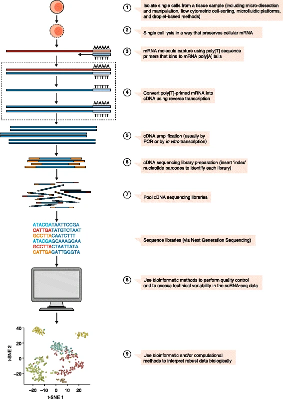

```{r, echo=FALSE}
knitr::opts_chunk$set(warning = FALSE, message = FALSE)
```

# What is this part of the hands-on about?

Here we will start with a very basic single-cell RNA-seq workflow in Bioconductor applied to a peripheral blood mononuclear cell dataset from 10X Genomics [(Zheng et al. 2017)](https://pubmed.ncbi.nlm.nih.gov/28091601/). Note that this R markdown is not meant to teach you all the steps of a single-cell RNA-seq workflow or the statistical reasoning behind them. We only use this workflow as an opportunity for you to practice what you learned in the hands-on. 

**Goals:**

- Try to understand and find out more about packages and functions you haven't used before
- Explore a `SummarizedExperiment`, understand how it changes throughout a workflow and extract information from different parts of it 
- Use what we learned about `ggplot2` package to explore a single-cell RNA-seq dataset through visualization   

**Abbreviations:**
- _scRNA-seq_: Single-Cell RNA-seq
- _UMI_: Unique Molecular Identifier
- _ADT_: Antibody-Derived Tags 

# Brief explanation of a single-cell RNA-seq workflow 

## Initial steps

scRNA-seq permits comparison of the transcriptome of individual cells. A typical workflow starts with 1) isolation of the single cells, 2) cell lysis while preserving mRNA, 3) mRNA capture, 4) reverse transcription of primed RNA into cDNA, 5) cDNA amplification 6) preparation of cDNA sequencing library [(Haque et al., 2017)](https://genomemedicine.biomedcentral.com/articles/10.1186/s13073-017-0467-4).



After sequencing, the reads are mapped to the reference genome. There are different kinds of scRNA-seq protocols. In UMI-based-protocols, one is not interested in the whole sequence of the mRNA but rather the number of mRNA expressed by each gene. The final output in these protocols in form of a matrix of expression values with the number of unique molecular identifiers mapped to each gene (row) in each cell (column). We will refer to the number of UMIs mapped to each gene in each cell as the gene's _counts_ in that cell. If you are unfamiliar with UMIs and want to understand more, check out [this figure](https://www.nature.com/articles/nmeth.2772/figures/1) from [Islam et al., 2014](https://www.nature.com/articles/nmeth.2772).

## Analysis of the count matrix 

1. _Data loading_: Depending on the output format of the processing pipeline, there are different ways to do this. Here we will learn how to read in output by Cellranger software (10X Genomics data). We will create a `SingleCellExperiment` object containing the count matrix. `SingleCellExperiment` is a class derived from `SummarizedExperiment` and has a few more slots that will come in handy. 
2. _Quality control_: Low-quality libraries can arise from cell damage during tissue dissociation or failure in library preparation due to inefficient reverse transcription or PCR amplification. This leads to cells with low total counts, few expressed genes and high mitochondrial proportion of counts. We will try to remove these low-quality cells. 
3. _Normalization_: Imagine cell 1 with a total of 100 counts and 50 counts for gene $x$. Imagine cell 2 with a total of 10 counts and 5 counts for gene $x$. Is this gene differentially expressed between the two cells? Probably not. In scRNA-seq protocoles, there are cell-specific biases in capture efficiency, proliferation efficiency etc. Normalization aims to ensure that observed heterogeneity is driven by biology and not technical biases. There are several normalization methods. Here we will divide all counts for each cell by a cell-specific scaling factor, often called _size factor_. After normalization, we apply a transformation, typically log, to adjust for mean-variance relationship [(Ahlamnn-Eltze & Huber, 2021)](https://www.biorxiv.org/content/10.1101/2021.06.24.449781v3.full.pdf). We will then use the log-normalized expression values for downstream analysis. 
4. _Dimensionality reduction _: Imagine a scRNA-seq dataset with 1 cell and 2 genes. We would need 2 dimensions and one point to plot our cell. We have about 20k gene so in reality this would be a 20k dimension plot for thousands of cells! It simply isn't possible to visualize this. Dimensionality reduction aims to reduce the number of dimensions. There are several dimensionality reduction methods such as PCA, UMAP or t-SNE. You are welcome to read more how these work but for now let's stick to a simplistic definition: they try to represent the variability of data in a 2 dimensional space. 
5. _Clustering_: The aim of clustering is to define groups of cells with similar expression profiles. There are several clustering methods, here we will use graph-based clustering. In this method one first builds a graph: each cell is represented by a point and is connected to the $k$ cells that have the most similar expression profile to it. This is a $k$-nearest-neighbor graph. Then one applies community detection methods to find the clusters. 

6. Further steps

  + Cell type annotation: assign a cell type label to the clusters
  + Differential analysis: find out genes that are differentially expressed between groups of cells 
  + Cell cycle assignment
  + Trajectory analysis

Our workflow does not cover these further steps but you could check out [OSCA](http://bioconductor.org/books/release/OSCA/book-contents.html#workflows) to learn more how to do this with Bioconductor packages. 

# Data loading

```{r}
library(SingleCellExperiment)
```

```{r}
# Download the raw data as on-disk cache
bfc <- BiocFileCache::BiocFileCache(ask=FALSE)
exprs.data <- BiocFileCache::bfcrpath(bfc, file.path(
    "http://cf.10xgenomics.com/samples/cell-vdj/3.1.0",
    "vdj_v1_hs_pbmc3",
    "vdj_v1_hs_pbmc3_filtered_feature_bc_matrix.tar.gz"))
# Extract files 
utils::untar(exprs.data, exdir=tempdir())

# Create a SingleCellExperiment from CellRanger output  
sce.pbmc <- DropletUtils::read10xCounts(file.path(tempdir(), "filtered_feature_bc_matrix"))
sce.pbmc
```

## **Challenge**

- What are the dimensions of the `SingleCellExperiment?` How many cells and how many features are present?
- Where is the count matrix stored? Which function of `SummarizedExperiment` package would you use to access it? What are its dimensions? How many cells and how many features is that? 
- Explore the `colData` and the `rowData` of `sce.pbmc`. What are their dimensions? What information do they store? 
- What are the two types of features stored in this `sce.pbmc`? _Hint_: look closer in `Type` column of `rowData`. How many features are there for each type? What does this mean biologically about our data? 

```{r}
# We will separate the experiment in two since we have two types of features. 
# An alternative experiment will store the features that are not in the majority set. 
sce.pbmc <- SingleCellExperiment::splitAltExps(sce.pbmc, rowData(sce.pbmc)$Type)
sce.pbmc
```

## **Challenge**

- How can we see the name of the alternative experiments stored in `sce.pbmc`? _Hint_: it is a function in `SingleCellExperient` package 

# Quality control 

```{r}
# Since we don't want to lose our original `SingleCellExperiment`, 
# we store it in an variable called unfiltered
unfiltered <- sce.pbmc
```

Now it is time to calculate some QC metrics. This could be done manually but the `scuttle` package makes it easier by doing it for us automatically.   

```{r}
# Find out the mitochondrial genes
is.mito <- grep("^MT-", rowData(sce.pbmc)$Symbol)
# Compute per-cell quality control metrics 
# We need to give the list of mitochondrial genes as an input
stats <- scuttle::perCellQCMetrics(sce.pbmc, subsets=list(Mito=is.mito))
```

## **Challenge**
  
- What does the `grep` function do?
- Go over the `stats` data frame and the help section of `perCellQCMetrics` function. What are the QC metrics that the function calculated for us?
- What is mean number of detected features per cell? Can you generate summary statistics for this QC metric? 

Now it's time to use the QC metrics to discard low-quality cells

```{r}
# Find out the cells that are outliers in terms of their mitochondrial expression percentage
## This is calculated based on the median absolute deviation (MAD) 
high.mito <- scuttle::isOutlier(stats$subsets_Mito_percent, type="higher")

# There are 17 antibodies in total
# Cells that have less than half of this number of detected antibodies are considered as low adt 
low.adt <- stats$`altexps_Antibody Capture_detected` < nrow(altExp(sce.pbmc))/2

# Is the cell to be discarded or not?
## Discard will be TRUE if the cell has high mitochondrial percentage or 
# low ADT
discard <- high.mito | low.adt
# Only keep the cells that have a FALSE value for `discard` 
sce.pbmc <- sce.pbmc[,!discard]
```

## **Challenge**
 
- How many cells were discarded? What percentage of cells were kept?

```{r}
# Add the statistics to unfiltered `colData`
colData(unfiltered) <- cbind(colData(unfiltered), stats)
# Add a new column to unfiltered to see which cells were discarded and which weren't 
unfiltered$discard <- discard
```

## **Challenge**

- We want to compare how the cells that we are discarding compare to the ones we keep in terms of total count, detected features, percentage of mitochondrial genes and ADT detected. What plots would you make to show that? Boxplot? Violinplot? Scatterplot? 
- Try to put all the 4 plots together in 4 panels
- Change the scale of the axes. _Hint:_ Try the log scale. What difference does it make?
- Try to play around with the theme: 

  + Change the font type and the font size
  + Try different themes such as `theme_bw()` or `theme_classic()`
  + Change the position of the legend
  + Make the dots on the legend bigger 
  + Change the color scheme 
  + Make the title bold 
  + Instead of 4 panels in 2x2, put the plots in a 1x4 format

While there are functions in the `scater` package that plot the QC metrics for us automatically, we encourage you to use ggplot and make these plots manually instead of using the ready-made functions. 

## **Challenge**
 
- Make a scatterlot of mitochondrial percentage against the total counts per cell. Color the scatterplot based on whether the cell is discarded or not. What do you observe? 

# Normalization

```{r}
# Set the seed prior to clustering 
set.seed(1000)
clusters <- scran::quickCluster(sce.pbmc)
# Compute the size factors for the main experiment
sce.pbmc <- scran::computeSumFactors(sce.pbmc, cluster=clusters)
# Compute the size factors for the alternative experiment
altExp(sce.pbmc) <- scuttle::computeMedianFactors(altExp(sce.pbmc))
```

## **Challenge**

- What is the data type of `clusters`?
- How many clusters are there?
- How many cells are in each cluster? 
- Where are the sizefactors stored for the gene expression assay and the antibody capture assay? Generate summary statistics for both of them. Can you draw two simple histogram of the sizefactors?
- Look at the help section of `computeSumFactors` and `computeMedianFactors`. Can you find out how the sizefactors are calculated? 
  
```{r}
# Log-transform the counts 
sce.pbmc <- SingleCellExperiment::applySCE(sce.pbmc, scuttle::logNormCounts)
```

## **Challenge**

- What does the `applySCE` function do? 
- Check the names of the assays? Is there a new one added? What data is there? 

## **Challenge**
 
- Take a look at `apply`, `sapply`, `lapply`, `vapply` and `replicate` functions. What do they do? It's good practice to learn them as they make life easier than using `for` loops every time you want to iterate over an action. 

## **Challenge**
 
- Plot the library size (total sum of counts per cell) against the sizefactor per cell that we estimated previously for both gene expression assay and antibody capture assay. What do you observe?

# Dimensionality reduction

```{r}
# Run TSNE
set.seed(100000)
altExp(sce.pbmc) <- scater::runTSNE(altExp(sce.pbmc))

# Run UMAP
set.seed(1000000)
altExp(sce.pbmc) <- scater::runUMAP(altExp(sce.pbmc))
```

## **Challenge**
 
- Why are we setting seed here? 
- Execute `SingleCellExperiment::reducedDimNames(altExp(sce.pbmc))`. What do you see? How could you access the UMAP coordinates of `altExp(sce.pbmc)`? _Hint_: You can use a very similar function in `SingleCellExperiment` package.
- Plot the UMAP coordinates of each cell using a scatterplot. 

_Hint_: we want a plot looking like this, but made manually with ggplot.

```{r}
scater::plotUMAP(altExp(sce.pbmc))
```


# Clustering 

Brief intro to graph-based clustering. 

Here we will encounter a new class: `ìgraph` 

```{r}
# Create a nearest-neighbor graph 
g.adt <- scran::buildSNNGraph(altExp(sce.pbmc), k=10, d=NA)
g.adt
```

## **Challenge**
 
- Explore `g.adt` through `str` and `length` functions. What is the data stored in each part?  

```{r}
# Find communities in the graph via random walks
clust.adt <- igraph::cluster_walktrap(g.adt)$membership
# Set the cluster names of the ADT data to the column labels of the ADT alternative experiment
SingleCellExperiment::colLabels(altExp(sce.pbmc)) <- factor(clust.adt)
# Check the colData to see if the labels are there
head(colData(altExp(sce.pbmc)))
```

## **Challenge**
 
- Plot the UMAP coordinates of each cell using a scatterplot. Then color it by the `label`.
- _Hint_: we want a plot looking like this, but made manually with ggplot.
- _Hint2_: Try binding the UMAP coordinates with the colData of `altExp(sce.pbmc)` and storing it in a new dataframe. 

```{r}
scater::plotUMAP(altExp(sce.pbmc), colour_by = "label")
```

Now we are going to subcluster to find more fine-grained groups of cells

```{r}
# Set the seed before subclustering
set.seed(1010010)

subclusters <- scran::quickSubCluster(x = sce.pbmc, 
                                      groups = clust.adt,
                                      prepFUN=function(x) {
                                        dec <- scran::modelGeneVarByPoisson(x)
                                        top <- scran::getTopHVGs(dec, prop=0.1)
                                        scran::denoisePCA(x, dec, subset.row=top)
                                        },
                                      clusterFUN=function(x) {
                                        g.gene <- scran::buildSNNGraph(x, k=10, use.dimred = 'PCA')
                                        igraph::cluster_walktrap(g.gene)$membership
                                        }
)
subclusters
```

## **Challenge**

- Look into the help section of `quickSubCluster`. What is each argument? 
- As you can see, `subclusters` is a list. Subset the first entry of the list, what is the data structure? 

## **Bonus**

-  Make a dataframe with 3 columns: cluster name, number of cells in the cluster, and number of subclusters in the cluster. _Hint_: Use the apply function
- Extract summary statistics for number of cells per cluster 

# Conclusion

Let's have a final overview of `SingleCellExperiment` object and how it changes throughout a workflow [from OSCA](https://robertamezquita.github.io/orchestratingSingleCellAnalysis/data-infrastructure.html).  


As a final **challenge**, discuss within your group what the advantages of using containers such as `SingleCellExperiment` for your analysis. How does it make your code more reproducible? Discuss other good coding practices that you learned in this hands-on and how this will affect your research. 

Thanks for joining this hands-on! 


